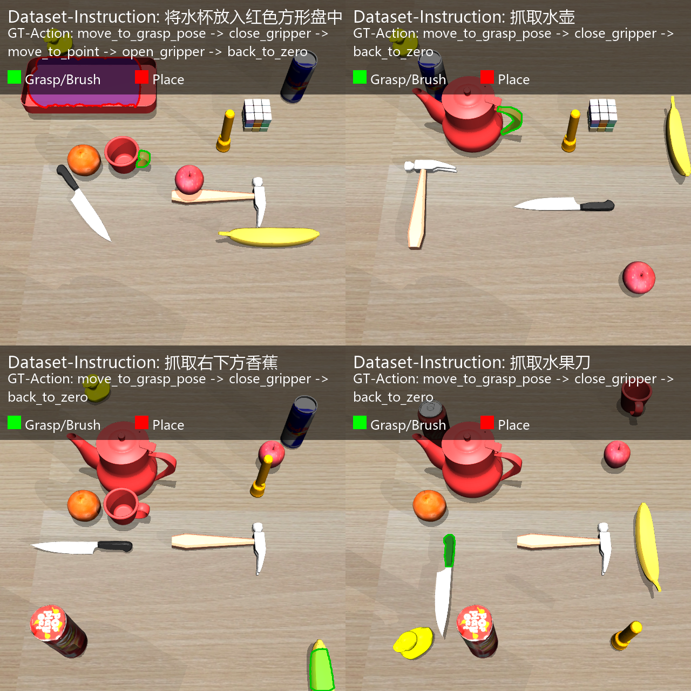
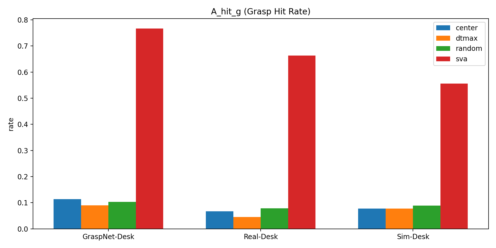
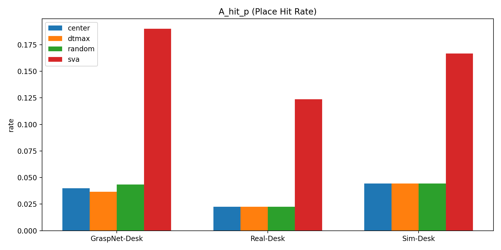
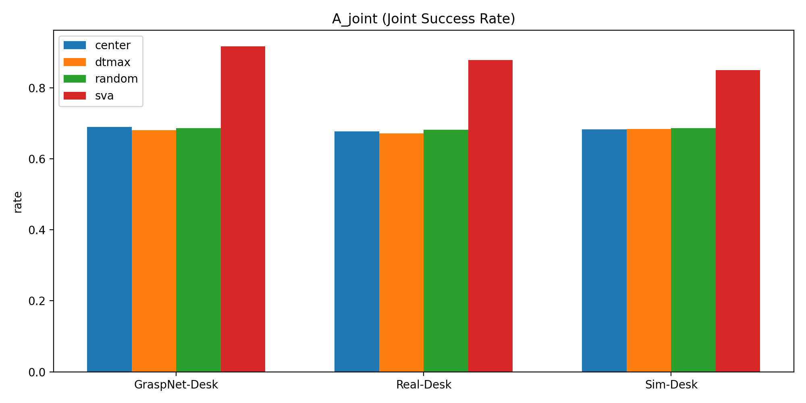
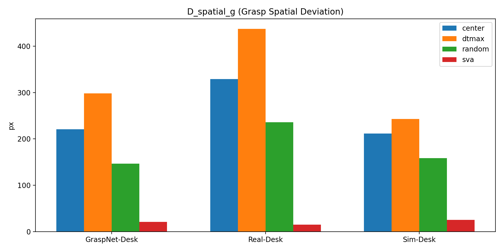
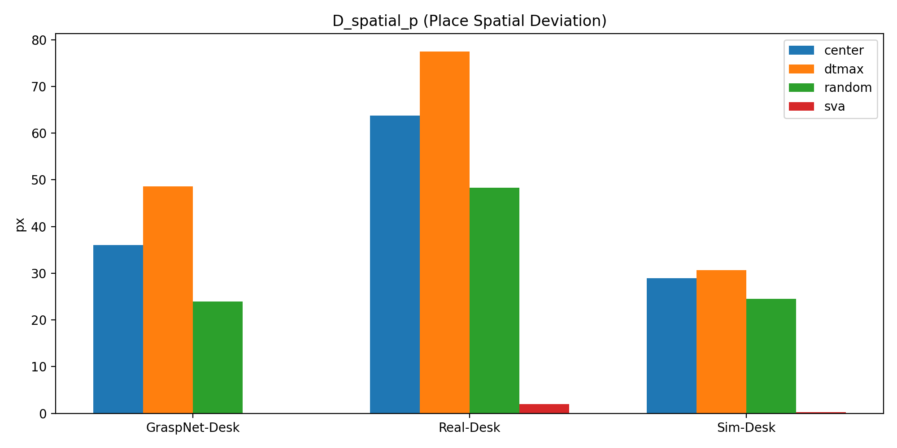

# 基于视觉提示的具身智能空间感知增强方法研究

**Research on Spatial Perception Enhancement Method for Embodied Intelligence Based on Visual Prompting**

 

 

本仓库按论文结构组织为四部分：**数据** · **方法** · **实验** · **结果**

---

## 项目结构

| 模块 | 说明 |
|:---:|:---|
| `vlm-spatial-grasp` | 论文主方法工程（SVA + SVP + 闭环抓取执行） |
| `paper_release` | 论文数据、标注工具、对比实验脚本、结果表格与图表 |

---

## 快速跳转

| 跳转目标 | 链接 |
|:---|:---:|
| 数据内容 |  |
| 实验映射 |  |
| 结果摘要 |  |

---

## 1. 数据内容（对应论文数据部分）

> 论文主评测数据：`paper_release/data/dist_all`（**160** 个 `.npz` 样本）

**三域划分**（与论文统计口径一致）：

| 域 | 样本范围 | 说明 |
|:---:|:---:|:---|
| GraspNet-Desk | `0 ~ 99` | 合成桌面场景 |
| Real-Desk | `100 ~ 129` | 真实桌面场景 |
| Sim-Desk | `130 ~ 159` | 仿真桌面场景 |

<b>样本字段说明</b>（点击展开）

**核心字段**（160/160）：
- `image`、`labeled_image`
- `instance_masks`、`results`
- `trajectories`（任务轨迹与金标准动作）

**补充字段**（少量样本）：
- `instruction`、`action`
- `keypoints`、`keypoint_ids`、`keypoint_mask_indices`

### 数据集示例图

| GraspNet-Desk | Real-Desk | Sim-Desk |
|---|---|---|
|  |  |  |

> 示例图来源：`paper_release/data/dataset_vis/`

---

## 2. 方法内容（对应论文方法部分）

### 论文主方法（SVA + SVP + 闭环执行）

> 位于 `vlm-spatial-grasp`

| 文件 | 功能 |
|:---|:---|
| `vision_agent_v2.py` | 结构化视觉锚点（SVA）+ 结构化视觉提示（SVP）主链路 |
| `main_vlm.py` | 端到端执行入口（支持 `VLM_METHOD=svp/qwen`） |
| `grasp_process.py` | 抓取候选生成与筛选 |
| `manipulator_grasp/` | MuJoCo 机械臂执行环境 |

### 论文对比方法（基线）

> 位于 `paper_release/experiments`

| 文件 | 方法 |
|:---|:---|
| `ours_svp_batch_inference.py` | SVP（我们的方法） |
| `qwen_batch_inference.py` | Qwen 基线 |
| `gpt_batch_inference.py` | GPT 基线 |

---

## 3. 实验内容（对应论文实验部分）

> **数据输入**：`paper_release/data/dist_all`
> **预测结果**：`paper_release/results/predictions_json/`

<b>预测结果子目录</b>（点击展开）

- `ai_results`、`ai_results_4o`
- `gpt-4o_results`、`gpt-5_results`
- `qwen_plus_results_newGT`、`qwen_flash_results_newGT`

### 论文表格与脚本映射

| 论文表号 | 表格含义 | 脚本 | 输出 |
|:---:|:---|:---|:---|
| **表3-2** | 三域数据规模统计 | 按 `dist_all` 文件名前缀统计 | 数据划分统计口径 |
| **表3-4** | 三域静态评估（命中率/偏差） | `paper_release/experiments/table3_3.py` | `results/tables/table3_3_ai_results*/summary.csv` |
| **表4-1** | Full（Oracle-Action）主对比 | `paper_release/experiments/table4_1.py` | `table4_full*.csv` |
| **表4-2** | Strict（Supplementary）一致性评估 | `paper_release/experiments/table4_2.py` | `table4_2_strict*.csv` |

> **注意**：`table3_3.py` 是历史脚本名，当前用于生成论文表3-4对应评估结果。

---

## 4. 结果内容（对应论文结果部分）

### 4.1 表4-1（`table4_full_recomputed.csv` 摘要）

| Method | A_hit_g | D_spatial_g_px | A_hit_p | D_spatial_p_px | A_joint |
|---|---:|---:|---:|---:|---:|
| E1-GPT-5 (Free-coordinate) | 0.342 | 46.299 | 0.785 | 10.032 | 0.423 |
| E1-GPT-4o (Free-coordinate) | 0.605 | 30.022 | 0.794 | 8.554 | 0.640 |
| E2-Qwen3-VL-Plus (Trained) | 0.785 | 29.901 | 0.897 | 10.767 | 0.805 |
| E2-Qwen3-VL-Flash (Trained) | 0.737 | 28.634 | 0.844 | 21.678 | 0.757 |
| **E3-GPT-5 (SVP-Full, Ours)** | **0.877** | **14.564** | **0.985** | **0.015** | **0.896** |
| E3-GPT-4o (SVP-Full, Ours) | 0.708 | 21.513 | 0.776 | 2.202 | 0.721 |

### 4.2 表4-2（`table4_2_strict_recomputed.csv` 摘要）

| Method | InstrMatch | TrajSucc | ActAcc | CoordHit | JointSucc | AvgDev_px |
|---|---:|---:|---:|---:|---:|---:|
| E1-GPT-5 (Free-coordinate) | 1.000 | 0.328 | 1.000 | 0.423 | 0.795 | 39.677 |
| E1-GPT-4o (Free-coordinate) | 1.000 | 0.595 | 1.000 | 0.640 | 0.872 | 26.050 |
| E2-Qwen3-VL-Plus (Trained Coord) | 1.000 | 0.770 | 1.000 | 0.805 | 0.931 | 26.407 |
| E2-Qwen3-VL-Flash (Trained Coord) | 1.000 | 0.716 | 0.995 | 0.754 | 0.910 | 28.024 |
| **E3-GPT-5 (SVP-Full, Ours)** | **1.000** | **0.873** | **1.000** | **0.896** | **0.963** | **11.789** |
| E3-GPT-4o (SVP-Full, Ours) | 1.000 | 0.672 | 0.993 | 0.721 | 0.894 | 17.205 |

### 4.3 三域结果图（表3-4对应）

| A_hit_g | A_hit_p | A_joint |
|---|---|---|
|  |  |  |

| D_spatial_g | D_spatial_p |
|---|---|
|  |  |

> 完整结果文件目录：`paper_release/results/tables/` · `paper_release/results/out_summary/`

---

## 5. 非论文主表文件（调试保留）

<b>以下文件不作为论文主表对应项</b>（点击展开）

- `paper_release/results/tables/table4_full_diag.csv`
- `paper_release/results/tables/table4_full_recomputed_diag.csv`
- `paper_release/results/tables/table3_4_*.csv`

---

